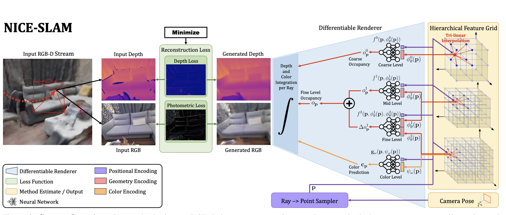

# NICE-SLAM-with-Adaptive-Feature-Grids-

## Milestones

- [x] **March 07:** Group formation and project selection
- [ ] **March 13**: Proposal
- [ ] **March 14:** Proposal presentations
- [ ] **March 14 - March 21:** Literature Reviewing
- [ ] **March 14 - April 25:** Correctly allocate sparse feature voxels based on ground truth camera pose and depth image. Avoid using any dense arrays for storage (No need to use NICE-SLAM) => don’t need the source code
- [ ] **April 25:** Midterm presentations
- [ ] **April 25 - May 09:** Integrate into NICE-SLAM, features can be updated correctly, able to work on e.g. Replica dataset
- [ ] **May 09 - May 16:** Test on kitti dataset, with whole pipeline (tracking & mapping) working correctly
- [ ] **May 30:** Final project presentations
- [ ] **June 13:** Final project reports

## Links

### [NICE-SLAM: Neural Implicit Scalable Encoding for SLAM](https://pengsongyou.github.io/media/nice-slam/NICE-SLAM.pdf)

#### **Abstract & Intro**: 

* SLAM: simultaneous localization and mapping
* Requirement
  * Real-time computation
  * Predictive: Can make prediction for regions without observation
  * Scalable: Can be scaled up to large scenes
  * Robust to noise
* Limitation of current methods: 
  * Over smoothed scene reconstruction, difficult to scale up to large scenes
  * Does not incorporate location information in the observations
* Idea: 
  * Use multi-level location information (hierarchical scene representation)
  * Incorporate inductive biases of neural implicit decoders pretrained at different spatial resolutions. 
  * Minimizing re-rendering losses

#### **Related work**:

* World-centric map representation, voxel grids => more accurate geometry at lower grid resolutions
* iMAP (baseline)
* ConvONet

#### **Method**:

* Hierarchical Feature Grid: The latent vector in ConvONet

  * Coarse (lowest resolution), mid, fine (highest resolution) grids

  * Each point represents a vector (feature including geometric ($\theta$) and color ($\omega$) information)

  * Level geometrtic representation
    
    $$
    o^{0}_{\textbf p} = f^{0}(\textbf p, \phi^{1}_{\theta}(\textbf p)) \\
    o^{1}_{\textbf p} = f^{1}(\textbf p, \phi^{1}_{\theta}(\textbf p)) \\
    \Delta o^{1}_{\textbf p} = f^{2}(\textbf p, \phi^{1}_{\theta}(\textbf p), \phi^{2}_{\theta}(\textbf p)) \\
    o_{\textbf p} = o^{1}_{\textbf p} + \Delta o^{1}_{\textbf p} \\
    $$
    , where 

    * $\textbf p$ represents the point location
    * occupancy value $o_{\textbf p}$ represents the probability of point $\textbf p$ that it is contained in the surface
    * $\phi$ represents tri-linear interpolation
    * $f$ are the neural networks (decoder)
    * $o^0_{\textbf p}$ is the occupancy obtained by mid-level which is used to predict the **unobserved part**. Note that for coarse-level, learnable Gaussian positional encoding is used for $\textbf p$ 
    * $o^1_{\textbf p}$ is the occupancy obtained by mid-level
    * $o^2_{\textbf p}$ is the residual obtained by a concatenation of the mid-level and fine-level features to capture high-frequency details

* Color representation: 
  
  $$
  c_{\textbf p} = g_{\omega}(\textbf p, \psi_{\omega}(\textbf p)) \\
  $$
  , where 

  * color value $c_{\textbf p}$ represents the estimated color
  * $g_{\omega}$ is a decoder
  * $\psi$ is the tri-linear interpolation of another feature grid

* Depth and color rendering

  * Camera pose defines the camera position $\textbf o$ and direction (unit vector) $\textbf r$

  * $N_{strat}$ samples for stratified sampling (different depths) , and $N_{imp}$ samples near the depth value of the current ray $+(-)0.05D$ along the ray $d_i, i \in \{1,...,N\}$
    $$
    {\textbf p_i} = {\textbf o} + d_i{\textbf r} \\
    $$

  * Calculate the probability of the existence for each point for each level (coarse $c$, fine $f$), and the depth and colors are represented as the expectation of the samples: 

    * the probability of the existence for each point is represented as the probability that the ray can reach the point

      $$
      w^c_i = o^0_{\textbf p_i}\prod_{j=1}^{i-1}(1-o^0_{\textbf p_j}), w^f_i = o_{\textbf p_i}\prod_{j=1}^{i-1}(1-o_{\textbf p_j})\\
      \hat D^c = \sum^{N}_{i=1}w^c_id_i, \hat D^f = \sum^{N}_{i=1}w^f_id_i, \hat I = \sum^{N}_{i=1}w^f_ic_i\\
      $$

    * the variance is also calculated:
        $$
        \hat D^c_{var} = \sum^{N}_{i=1}w^c_i(\hat D^c - d_i)^2, \hat D^f_{var} = \sum^{N}_{i=1}w^f_i(\hat D^f - d_i)^2
        $$

* Optimization

  * Pretrained decoder: The decoders $f$ are trained separately as the decoder part of ConvONet. Note the difference is that $f^2$ is trained by a concatenated feature.  This is fixed during optimization.

  * Loss

    * Geometric loss
      $$
      \mathcal L^l_g = {1 \over M}\sum^{M}_{m=1}|D_m - \hat D^l_m|, l \in\{c,f\}.
      $$

    * Photometric loss
      $$
      \mathcal L_p = {1 \over M}\sum^{M}_{m=1}|I_m - \hat I_m|.
      $$
      
    * Modified geometric loss
      $$
      \mathcal L_{g\_var} = {1 \over M_t}\sum^{M_t}_{m=1}{|D_m - \hat D^c_m| \over \sqrt{\hat D^c_{var}}} + {|D_m - \hat D^f_m| \over \sqrt{\hat D^f_{var}}}.
      $$
    
  * Reconstruction
  
    * First: Optimize mid-level $\phi^1_{\theta}$ Using $\mathcal L^f_g$ 
  
    * Second: Optimize $\phi^1_{\theta}$, $\phi^2_{\theta}$ features with the same fine-level depth loss $\mathcal{L}^f_g$ 
  
    * Third: Optimize feature grids at all levels and **color decoder** using the following loss
      $$
      \min_{\theta, \omega}(\mathcal L^c_g + \mathcal L^f_g + \lambda_p\mathcal L_p)
      $$
  
  * Camera Tracking: optimize modified geometric loss $\mathcal L_{g\_var}$ 
    $$
    \min_{\bf R, t}(\mathcal L_{g\_var} + \lambda_{pt}\mathcal L_p)
    $$
  
  * Robustness to Dynamic Objects: remove pixel from optimization if the loss is larger than 10 times of the median loss of all pixels
  
* Keyframe selection: only incloude keyframes which have visual overlap with the current cframe when optimizing the scene geometry => only optimize necessary parameters. 

### [DI-Fusion: Online Implicit 3D Reconstruction with Deep Priors](https://arxiv.org/pdf/2012.05551.pdf)

### [Real-time 3D Reconstruction at Scale using Voxel Hashing](https://niessnerlab.org/papers/2013/4hashing/niessner2013hashing.pdf)

### [Convolutional Occupancy Networks](https://arxiv.org/pdf/2003.04618.pdf)

### [DI-Fusion code](https://github.com/huangjh-pub/di-fusion)

### [Dataset](http://www.cvlibs.net/datasets/kitti/index.php) 

